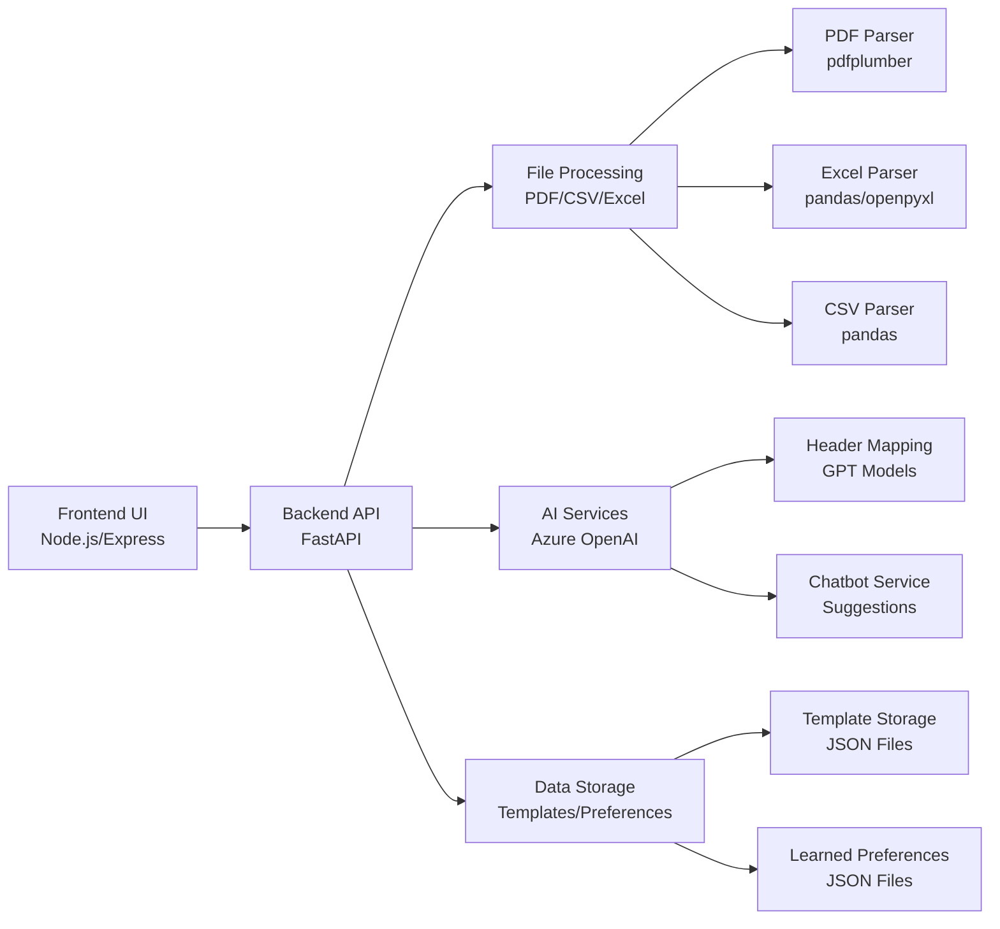
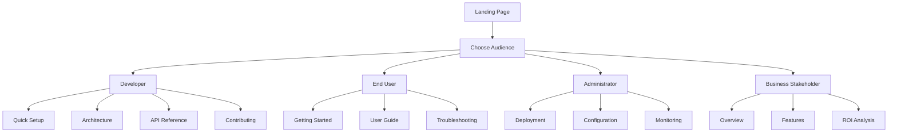
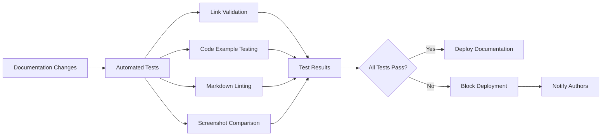

# Design Document

## Overview

This design document outlines the comprehensive documentation system for the Vendor Statements Processing System. The documentation will be structured as a multi-layered, audience-specific system that provides technical depth for developers while maintaining accessibility for end users and administrators.

The documentation system will be implemented as a combination of:
- Structured markdown files organized by audience and purpose
- Interactive API documentation using OpenAPI/Swagger
- Architectural diagrams using Mermaid
- Code-level documentation integrated into the source
- Deployment and operational guides

## Architecture

### Documentation Structure

```mermaid
graph TD
    A[Documentation Root] --> B[Technical Documentation]
    A --> C[User Documentation]
    A --> D[Administrative Documentation]
    A --> E[API Documentation]
    A --> F[Business Documentation]
    
    B --> B1[Architecture Guide]
    B --> B2[Developer Setup]
    B --> B3[Code Reference]
    B --> B4[Testing Guide]
    
    C --> C1[Quick Start Guide]
    C --> C2[User Manual]
    C --> C3[Troubleshooting]
    C --> C4[FAQ]
    
    D --> D1[Deployment Guide]
    D --> D2[Configuration Reference]
    D --> D3[Monitoring Setup]
    D --> D4[Security Guide]
    
    E --> E1[REST API Reference]
    E --> E2[Integration Examples]
    E --> E3[Data Models]
    E --> E4[Error Codes]
    
    F --> F1[Business Overview]
    F --> F2[Feature Documentation]
    F --> F3[Performance Metrics]
    F --> F4[Cost Analysis]
```



### System Architecture Documentation

The system consists of three main components that require comprehensive documentation:

1. **Backend API (FastAPI)**: Core processing engine with AI-powered field mapping
2. **Frontend UI (Node.js/Express)**: Web interface and API proxy
3. **AI Integration (Azure OpenAI)**: Intelligent header mapping and chatbot assistance



## Components and Interfaces

### Documentation Components

#### 1. Technical Documentation Module
- **Purpose**: Serve developers and technical contributors
- **Components**:
  - Architecture diagrams with component relationships
  - API reference with request/response examples
  - Database schema and data flow documentation
  - Development environment setup guides
  - Code contribution guidelines

#### 2. User Documentation Module
- **Purpose**: Guide end users through system functionality
- **Components**:
  - Quick start tutorials with screenshots
  - Step-by-step workflow guides
  - Template management instructions
  - Error resolution guides
  - Feature-specific help sections

#### 3. Administrative Documentation Module
- **Purpose**: Support system administrators and DevOps teams
- **Components**:
  - Deployment guides for different environments
  - Configuration reference with security considerations
  - Monitoring and logging setup
  - Backup and recovery procedures
  - Performance tuning guidelines

#### 4. API Documentation Module
- **Purpose**: Enable integration and maintenance
- **Components**:
  - OpenAPI/Swagger specifications
  - Interactive API explorer
  - Authentication and authorization guides
  - Rate limiting and error handling
  - SDK and client library documentation

### Interface Design

#### Documentation Navigation


## Data Models

### Documentation Content Models

#### Document Structure
```typescript
interface DocumentationPage {
  id: string;
  title: string;
  audience: 'developer' | 'user' | 'admin' | 'business';
  category: string;
  tags: string[];
  content: string; // Markdown content
  lastUpdated: Date;
  version: string;
  prerequisites?: string[];
  relatedPages?: string[];
}
```

#### Code Documentation Model
```typescript
interface CodeDocumentation {
  module: string;
  functions: FunctionDoc[];
  classes: ClassDoc[];
  constants: ConstantDoc[];
  examples: CodeExample[];
}

interface FunctionDoc {
  name: string;
  description: string;
  parameters: Parameter[];
  returns: ReturnType;
  examples: string[];
  seeAlso?: string[];
}
```

#### API Documentation Model
```typescript
interface APIEndpoint {
  path: string;
  method: 'GET' | 'POST' | 'PUT' | 'DELETE';
  summary: string;
  description: string;
  parameters: APIParameter[];
  requestBody?: RequestBodySchema;
  responses: ResponseSchema[];
  examples: APIExample[];
  authentication: AuthRequirement[];
}
```

## Error Handling

### Documentation Error Scenarios

1. **Missing Documentation**: Automated checks for undocumented code
2. **Outdated Content**: Version tracking and update notifications
3. **Broken Links**: Automated link validation
4. **Inconsistent Formatting**: Style guide enforcement
5. **Missing Examples**: Template validation for required examples

### Error Recovery Strategies

- **Automated Generation**: Generate basic documentation from code comments
- **Template Fallbacks**: Provide standard templates for missing sections
- **Community Contributions**: Enable user-contributed documentation
- **Version Rollback**: Maintain documentation version history

## Testing Strategy

### Documentation Testing Approach

#### 1. Content Validation
- **Markdown Linting**: Ensure consistent formatting and structure
- **Link Validation**: Verify all internal and external links
- **Code Example Testing**: Automated testing of code snippets
- **Screenshot Validation**: Ensure UI screenshots are current

#### 2. Accessibility Testing
- **Screen Reader Compatibility**: Test with assistive technologies
- **Color Contrast**: Ensure adequate contrast ratios
- **Keyboard Navigation**: Verify full keyboard accessibility
- **Mobile Responsiveness**: Test on various device sizes

#### 3. User Experience Testing
- **Task Completion**: Test common user workflows
- **Search Functionality**: Validate search accuracy and speed
- **Navigation Efficiency**: Measure time to find information
- **Feedback Collection**: Implement user feedback mechanisms

#### 4. Technical Accuracy Testing
- **Code Compilation**: Verify all code examples compile/run
- **API Response Validation**: Test API examples against live endpoints
- **Environment Setup**: Test setup instructions on clean systems
- **Version Compatibility**: Ensure documentation matches current version

### Testing Automation



### Performance Testing
- **Page Load Times**: Ensure documentation loads quickly
- **Search Performance**: Test search response times
- **Mobile Performance**: Validate performance on mobile devices
- **CDN Effectiveness**: Test content delivery optimization

### Integration Testing
- **API Documentation Sync**: Ensure API docs match actual endpoints
- **Code Documentation Sync**: Verify code comments match documentation
- **Version Alignment**: Test documentation against multiple software versions
- **Cross-Reference Validation**: Ensure internal references are accurate