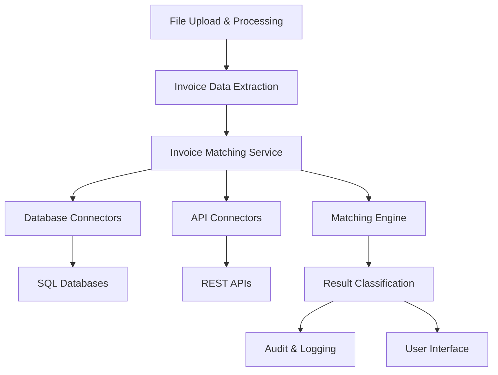

# Design Document

## Overview

The Invoice Matching Database Integration feature extends the existing vendor statement processing system to provide automated invoice verification capabilities. This feature will integrate with internal or external invoice databases to match extracted invoice data against existing records, providing classification results that help users identify invoice authenticity, detect duplicates, and flag discrepancies.

The system builds upon the existing architecture that includes file parsing, data validation, and storage services, adding a new invoice matching service that can connect to various database types and APIs.

## Architecture

### High-Level Architecture



### Integration Points

The invoice matching system integrates with existing components:

- **File Parser**: Leverages existing `file_parser.py` to extract invoice data
- **Data Validator**: Extends `data_validator.py` with new matching validation functions
- **Storage Service**: Uses `storage_service.py` for configuration and audit data storage
- **Flask Application**: Integrates with `app.py` through new API endpoints
- **Field Definitions**: Utilizes existing `field_definitions.json` for data mapping

## Components and Interfaces

### 1. Invoice Matching Service (`invoice_matching_service.py`)

**Primary Interface:**
```python
class InvoiceMatchingService:
    def match_invoice(self, invoice_data: Dict[str, Any]) -> MatchResult
    def configure_connection(self, connection_config: ConnectionConfig) -> bool
    def test_connection(self, connection_id: str) -> ConnectionTestResult
    def get_matching_statistics(self) -> Dict[str, Any]
```

**Key Responsibilities:**
- Orchestrate the matching process
- Manage database/API connections
- Coordinate between matching algorithms and result classification
- Handle connection pooling and retry logic

### 2. Database Connectors (`database_connectors/`)

**SQL Database Connector (`sql_connector.py`):**
```python
class SQLConnector:
    def __init__(self, connection_config: SQLConnectionConfig)
    def execute_match_query(self, search_criteria: Dict[str, Any]) -> List[Dict[str, Any]]
    def test_connection(self) -> bool
    def get_connection_info(self) -> Dict[str, str]
```

**API Connector (`api_connector.py`):**
```python
class APIConnector:
    def __init__(self, connection_config: APIConnectionConfig)
    def search_invoices(self, search_criteria: Dict[str, Any]) -> List[Dict[str, Any]]
    def test_connection(self) -> bool
    def get_rate_limit_info(self) -> Dict[str, Any]
```

**Supported Database Types:**
- PostgreSQL
- MySQL
- SQL Server
- Oracle
- SQLite (for testing)

### 3. Matching Engine (`matching_engine.py`)

**Core Interface:**
```python
class MatchingEngine:
    def find_matches(self, invoice_data: Dict[str, Any], database_results: List[Dict[str, Any]]) -> List[Match]
    def calculate_confidence_score(self, invoice_data: Dict[str, Any], candidate: Dict[str, Any]) -> float
    def apply_fuzzy_matching(self, field1: str, field2: str, algorithm: str = 'levenshtein') -> float
```

**Matching Algorithms:**
- Exact matching for invoice numbers
- Fuzzy string matching for vendor/customer names (Levenshtein distance, Jaro-Winkler)
- Date range matching with configurable tolerance
- Amount comparison with percentage variance thresholds

### 4. Result Classification (`result_classifier.py`)

**Classification Interface:**
```python
class ResultClassifier:
    def classify_matches(self, matches: List[Match]) -> MatchResult
    def determine_match_type(self, match: Match) -> MatchType
    def generate_discrepancy_report(self, match: Match) -> DiscrepancyReport
```

**Classification Types:**
- **Found**: Perfect match on all criteria
- **Not Found**: No matches found in database
- **Partial Match**: Match found with discrepancies

### 5. Configuration Manager (`config_manager.py`)

**Configuration Interface:**
```python
class ConfigManager:
    def save_connection_config(self, config: ConnectionConfig) -> bool
    def load_connection_config(self, connection_id: str) -> ConnectionConfig
    def get_matching_settings(self) -> MatchingSettings
    def update_matching_settings(self, settings: MatchingSettings) -> bool
```

## Data Models

### Connection Configuration

```python
@dataclass
class SQLConnectionConfig:
    connection_id: str
    database_type: str  # 'postgresql', 'mysql', 'sqlserver', 'oracle'
    host: str
    port: int
    database: str
    username: str
    password: str  # Encrypted in storage
    connection_timeout: int = 30
    query_timeout: int = 60
    max_connections: int = 5

@dataclass
class APIConnectionConfig:
    connection_id: str
    base_url: str
    api_key: str  # Encrypted in storage
    authentication_type: str  # 'api_key', 'bearer_token', 'basic_auth'
    timeout: int = 30
    rate_limit: int = 100  # requests per minute
    retry_attempts: int = 3
```

### Matching Data Models

```python
@dataclass
class InvoiceData:
    invoice_number: str
    vendor_name: str
    customer_name: str
    invoice_date: datetime
    total_amount: Decimal
    facility_name: Optional[str] = None
    po_number: Optional[str] = None

@dataclass
class Match:
    candidate_data: Dict[str, Any]
    confidence_score: float
    matched_fields: List[str]
    discrepancies: List[Discrepancy]
    match_type: MatchType

@dataclass
class MatchResult:
    invoice_data: InvoiceData
    classification: str  # 'found', 'not_found', 'partial_match'
    matches: List[Match]
    confidence_score: float
    processing_time: float
    search_criteria_used: Dict[str, Any]
```

### Discrepancy Tracking

```python
@dataclass
class Discrepancy:
    field_name: str
    expected_value: Any
    actual_value: Any
    variance_type: str  # 'amount_variance', 'date_variance', 'name_mismatch'
    variance_amount: Optional[float] = None
    variance_percentage: Optional[float] = None
```

## Error Handling

### Connection Error Handling

1. **Database Connection Failures:**
   - Implement exponential backoff retry logic
   - Maintain connection pool health monitoring
   - Fallback to alternative database connections if configured
   - Queue matching requests during outages

2. **API Rate Limiting:**
   - Implement rate limiting with token bucket algorithm
   - Queue requests when rate limits are exceeded
   - Provide estimated retry times to users

3. **Query Timeouts:**
   - Configurable timeout settings per connection
   - Graceful degradation with partial results
   - Logging of slow queries for optimization

### Data Validation Errors

1. **Invalid Invoice Data:**
   - Validate required fields before matching
   - Provide clear error messages for missing data
   - Continue processing other invoices in batch operations

2. **Database Schema Mismatches:**
   - Flexible field mapping configuration
   - Runtime schema validation
   - Graceful handling of missing database fields

## Testing Strategy

### Unit Testing

1. **Matching Engine Tests:**
   - Test fuzzy matching algorithms with known datasets
   - Validate confidence score calculations
   - Test edge cases (empty strings, special characters)

2. **Database Connector Tests:**
   - Mock database connections for unit tests
   - Test connection pooling and retry logic
   - Validate SQL query generation

3. **Classification Logic Tests:**
   - Test all classification scenarios
   - Validate discrepancy detection accuracy
   - Test threshold configurations

### Integration Testing

1. **Database Integration:**
   - Test with real database instances
   - Validate connection configuration management
   - Test transaction handling and rollback scenarios

2. **API Integration:**
   - Test with mock API servers
   - Validate authentication mechanisms
   - Test rate limiting and retry behavior

3. **End-to-End Testing:**
   - Test complete invoice processing workflow
   - Validate audit trail generation
   - Test performance with large datasets

### Performance Testing

1. **Load Testing:**
   - Test with high volume of concurrent matching requests
   - Validate connection pool performance
   - Test memory usage with large result sets

2. **Database Performance:**
   - Test query performance with large invoice databases
   - Validate index usage and query optimization
   - Test connection timeout scenarios

## Security Considerations

### Data Protection

1. **Credential Management:**
   - Encrypt database passwords and API keys at rest
   - Use environment variables for sensitive configuration
   - Implement credential rotation capabilities

2. **Data Transmission:**
   - Use TLS/SSL for all database connections
   - Validate SSL certificates for API connections
   - Implement request signing for sensitive APIs

3. **Access Control:**
   - Role-based access to matching configuration
   - Audit logging for all configuration changes
   - Secure storage of connection configurations

### Compliance

1. **Data Privacy:**
   - Mask sensitive data in logs
   - Implement data retention policies
   - Support data deletion requests

2. **Audit Requirements:**
   - Comprehensive logging of all matching activities
   - Immutable audit trails
   - Configurable log retention periods

## Performance Optimization

### Caching Strategy

1. **Connection Caching:**
   - Maintain persistent database connections
   - Cache API authentication tokens
   - Implement connection health checks

2. **Result Caching:**
   - Cache frequent matching queries
   - Implement cache invalidation strategies
   - Use Redis for distributed caching if needed

### Query Optimization

1. **Database Indexing:**
   - Recommend optimal indexes for invoice tables
   - Support composite indexes for multi-field searches
   - Monitor query performance metrics

2. **Batch Processing:**
   - Support bulk matching operations
   - Implement parallel processing for large batches
   - Optimize memory usage for large datasets

## Monitoring and Observability

### Metrics Collection

1. **Performance Metrics:**
   - Matching request latency
   - Database query execution times
   - API response times
   - Connection pool utilization

2. **Business Metrics:**
   - Match success rates by classification
   - Most common discrepancy types
   - Database connection health
   - Processing volume trends

### Alerting

1. **System Health Alerts:**
   - Database connection failures
   - API rate limit exceeded
   - High error rates
   - Performance degradation

2. **Business Logic Alerts:**
   - Unusual spike in "Not Found" results
   - High percentage of partial matches
   - Significant changes in matching patterns